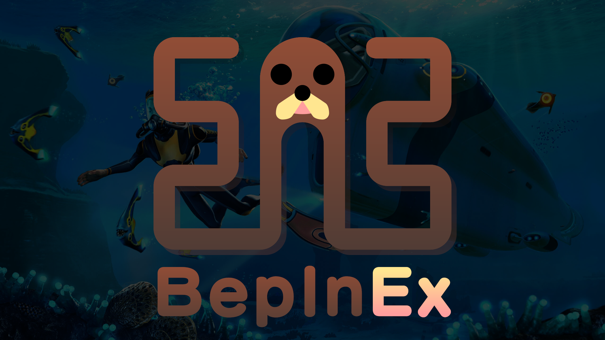

# Tobey's BepInEx Pack for Subnautica

This is a [BepInEx](https://github.com/BepInEx/BepInEx) pack for Subnautica, preconfigured and ready to use on Windows, macOS and Linux (including SteamOS)!

BepInEx is a general purpose framework for Unity modding. BepInEx includes tools and libraries to

-   load custom code (hereafter _plugins_) into the game on launch;
-   patch in-game methods, classes and even entire assemblies without touching original game files;
-   configure plugins and log game to desired outputs like console or file;
-   manage plugin dependencies.

BepInEx is currently [one of the most popular modding tools for Unity on GitHub](https://github.com/topics/modding?o=desc&s=stars).

## This pack's contents

This pack is preconfigured and ready to use for Subnautica modding.\
In particular, this pack comes with

-   [Tobey.Subnautica.ConfigHandler](https://github.com/toebeann/Tobey.Subnautica.ConfigHandler), a configurable BepInEx patcher to automatically take care of BepInEx configuration for backwards compatibility with mods from older game versions (e.g. QModManager),
-   [Tobey.UnityAudio](https://github.com/toebeann/Tobey.UnityAudio), a configurable BepInEx patcher to automatically add Unity audio support when mods need it,
-   [Tobey.FileTree](https://github.com/toebeann/Tobey.FileTree), a configurable BepInEx plugin which logs the game's file tree to aid in troubleshooting issues, and
-   [Tobey.BepInEx.Timestamp](https://github.com/toebeann/Tobey.BepInEx.Timestamp), a configurable BepInEx patcher which logs the current timestamp.

## Compatibility with QModManager

The TL;DR is that QModManager is compatibile with BepInEx, [but there are some things to bear in mind](https://github.com/toebeann/BepInEx.Subnautica/wiki/Compatibility-with-QModManager).

> [!CAUTION]
>
> **Do not** install QModManager unless you are on the legacy branch, otherwise it **will** cause issues.

## Easy Automated Installation

> [!IMPORTANT]
>
> **With just this pack installed, you will not see any changes in-game!**
>
> Check the `LogOutput.log` file in the `BepInEx` folder to determine whether BepInEx has loaded.

### Windows (Vortex)

[Vortex](https://www.nexusmods.com/about/vortex/) is a tool for installing and managing mods on Windows. It can install all kinds of mods for Subnautica and other games, including this pack.

1. Install [Vortex Mod Manager](https://www.nexusmods.com/about/vortex/) if you haven't already. Make sure it's fully up-to-date.
1. Click the Vortex button at the top of [the Nexus Mods mod page](https://www.nexusmods.com/subnautica/mods/1108) to install.
1. Check the 🔔 notifications area at the top right of Vortex:
    - If you have QModManager installed, Vortex might notify you to reinstall/uninstall QModManager. Just do whatever it says.
    - If you see a notification saying "Elevation needed to deploy," click `Elevate` and authorize the elevation.
    - If you see any other notifications saying "Deployment needed" or similar, click `Deploy`.
1. Run the game.

### macOS (gib)

[gib](https://github.com/toebeann/gib) is a command-line tool which automates installation of BepInEx on macOS, as installing it manually is quite cumbersome and error-prone. gib makes it easy.

1. [Download Tobey's BepInEx Pack for Subnautica](https://github.com/toebeann/BepInEx.Subnautica/releases/latest/download/Tobey.s.BepInEx.Pack.for.Subnautica.zip). Make sure to unzip it in your Downloads folder if your browser doesn't do this automatically.
1. Open Terminal with Launchpad or Spotlight (press `⌘ Space`, type `terminal`, press `Enter`).
1. Copy the command from [the Usage section of the gib README](https://github.com/toebeann/gib#usage) and paste it into the Terminal with `⌘ V`, and press `Enter` to run it.

If you get stuck, refer to the [gib README](https://github.com/toebeann/gib#readme) for help.

## Manual Installation

> [!WARNING]
>
> It is _strongly_ recommended that macOS users [install with gib](#macos-gib), as manual installation on macOS is _extremely_ tedious and error prone!
>
> If you are a glutton for punishment and are determined to install manually, follow [the idiot's guide to macOS installation](https://github.com/toebeann/BepInEx.Subnautica/wiki/Idiot's-guide-to-macOS-installation).

> [!TIP]
>
> The game folder is the folder containing the game's executable (e.g. `Subnautica.exe`).
>
> Steam users can find the game folder by right-clicking the game in their Steam library and selecting `Manage` -> `Browse local files`.

To install manually, follow these instructions:

1. [Download Tobey's BepInEx Pack for Subnautica](https://github.com/toebeann/BepInEx.Subnautica/releases/latest/download/Tobey.s.BepInEx.Pack.for.Subnautica.zip).
1. Extract the contents of the downloaded archive into the game folder.\
   **ℹ️** _That just means open the .zip file and drag the files and folders out into the game folder!_
1. Depending on your operating system:
    - Windows users: Run the game.
    - Linux (SteamOS etc.) & macOS users: Follow the configuration instructions for your operating system below:

> [!IMPORTANT]
>
> **With just this pack installed, you will not see any changes in-game!**
>
> Check the `LogOutput.log` file in the `BepInEx` folder to determine whether BepInEx has loaded.

### Configuration on Linux (SteamOS etc.)

1. If you don't own the game on Steam, add it to Steam as a non-Steam game.
1. In Steam, go to the game's properties and set the launch arguments to:
    ```
    WINEDLLOVERRIDES="winhttp=n,b" %command%
    ```
1. Run the game via Steam.

### Configuration on macOS

[Follow the idiot's guide to macOS installation](https://github.com/toebeann/BepInEx.Subnautica/wiki/Idiot's-guide-to-macOS-installation).

## Installing mods

> [!NOTE]
>
> The paths in this section are relative to the game folder, i.e. `BepInEx/plugins` = `[game folder]/BepInEx/plugins`, where `[game folder]` is the path to the folder containing the game's executable (e.g. `Subnautica.exe`).
>
> Steam users can find the game folder by right-clicking the game in their Steam library and selecting `Manage` -> `Browse local files`.

> [!TIP]
>
> "Extract the .zip" simply means take the contents of the .zip file and put them in the specified location.
>
> For example, if you are told to "extract the .zip" or "extract the contents of the archive" into `BepInEx/plugins`, then you can simply open the .zip archive by double-clicking on it, then just select everything inside and drag the contents into your `BepInEx/plugins` folder. Easy!

> [!CAUTION]
> Nautilus and SMLHelper are incompatible. If you want to use mods for Nautilus, you _can't_ use SMLHelper, and vice versa.

**It is _strongly_ recommended to read and follow the instructions provided in the description of each mod you download.**

However, sometimes mod authors don't give good (or any) instructions, or you just can't be bothered to read them (we've all been there). For those occasions, here's a simple reference:

### Mod installation by type

| Mod type        | Where to extract the .zip |
| --------------- | ------------------------- |
| BepInEx plugin  | `BepInEx/plugins`         |
| BepInEx patcher | `BepInEx/patchers`        |
| QMod            | `QMods`                   |

> [!IMPORTANT]
>
> QModManager and QMods are _only_ for use on the legacy branch! See [Compatibility with QModManager](https://github.com/toebeann/BepInEx.Subnautica/wiki/Compatibility-with-QModManager) for details.

### Mod installation by .zip structure

| Folder located in root of .zip | Where to extract the .zip                      |
| ------------------------------ | ---------------------------------------------- |
| `BepInEx`                      | Directly in the game folder                    |
| `plugins`                      | `BepInEx`                                      |
| `patchers`                     | `BepInEx`                                      |
| `Some Mod Name`                | Try `BepInEx/plugins` first, otherwise `QMods` |
| `QMods`                        | Directly in the game folder                    |

> [!IMPORTANT]
>
> QModManager and QMods are _only_ for use on the legacy branch! See [Compatibility with QModManager](https://github.com/toebeann/BepInEx.Subnautica/wiki/Compatibility-with-QModManager) for details.

### Mod installation by requirements

> [!TIP]
>
> On Nexus mod pages, you can usually see a mod's requirements by expanding the `Requirements` near the top of the description tab. Otherwise, read the mod's description.

| Listed in requirements or mentioned somewhere on the page | Where to extract the .zip                                                                                                                               |
| --------------------------------------------------------- | ------------------------------------------------------------------------------------------------------------------------------------------------------- |
| BepInEx / this BepInEx pack                               | Probably `BepInEx/plugins`, maybe `BepInEx/patchers`. Use common sense and refer to [the .zip structure](#mod-installation-by-zip-structure) as needed. |
| Nautilus                                                  | Probably `BepInEx/plugins`. Use common sense and refer to [the .zip structure](#mod-installation-by-zip-structure) as needed.                           |
| QModManager                                               | `QMods`                                                                                                                                                 |
| SMLHelper                                                 | Try `BepInEx/plugins` first, otherwise `QMods`                                                                                                          |

> [!IMPORTANT]
>
> QModManager and QMods are _only_ for use on the legacy branch! See [Compatibility with QModManager](https://github.com/toebeann/BepInEx.Subnautica/wiki/Compatibility-with-QModManager) for details.

### I still can't figure it out!

First, double check and follow the instructions on the mod page. If you still can't figure it out or there aren't any instructions on the mod page, you'll have to get in touch with the author of the mod somehow. Your best bet is usually going to be the Nexus Mods posts tab of that mod. Make sure to check that the question hasn't already been asked and answered.

## Useful links for mod authors

-   [Doorstop: debugging Unity Mono games](https://github.com/NeighTools/UnityDoorstop#debugging-in-unitymono)
-   [BepInEx: writing basic plugin walkthrough](https://docs.bepinex.dev/articles/dev_guide/plugin_tutorial/)
-   [BepInEx: useful plugins for modding](https://docs.bepinex.dev/articles/dev_guide/dev_tools.html)
-   [BepInEx: patching game methods at runtime](https://docs.bepinex.dev/articles/dev_guide/runtime_patching.html)

## Issues, questions, etc.

First, please make sure to check that the answer you're looking for isn't already somewhere on this page. Use Ctrl+F to search for keywords.

Second, check [the FAQ](https://github.com/toebeann/BepInEx.Subnautica/wiki/FAQ) to see if there is an answer there.

If not, at this moment, you can use the following channels to ask for help

-   [Subnautica Modding Community Discord](https://discord.gg/UpWuWwq)
-   [Nexus Mods posts tab](https://www.nexusmods.com/subnautica/mods/1108/?tab=posts)
-   [GitHub issues](https://github.com/toebeann/BepInEx.Subnautica/issues)
-   [BepInEx Discord](https://discord.gg/MpFEDAg) -- **Intended for developers, only technical support for BepInEx itself will be provided. No support for mods.**

## Licensing

This GitHub repository contains no code or binaries from external sources, only code used to automatically put together a preconfigured .zip of the BepInEx pack.

However, the .zip created by this repository's code contains binaries from the following projects, redistributed without modification and in accordance with their licenses:

| Project                                                                                      | License(s)                                                                               |
| -------------------------------------------------------------------------------------------- | ---------------------------------------------------------------------------------------- |
| [BepInEx](https://github.com/BepInEx/BepInEx)                                                | [LGPL-2.1](https://github.com/BepInEx/BepInEx/blob/master/LICENSE)                       |
| [Tobey.Subnautica.ConfigHandler](https://github.com/toebeann/Tobey.Subnautica.ConfigHandler) | [LGPL-3.0](https://github.com/toebeann/Tobey.Subnautica.ConfigHandler/blob/main/LICENSE) |
| [Tobey.UnityAudio](https://github.com/toebeann/Tobey.UnityAudio)                             | [LGPL-3.0](https://github.com/toebeann/Tobey.UnityAudio/blob/main/LICENSE)               |
| [Tobey.FileTree](https://github.com/toebeann/Tobey.FileTree)                                 | [LGPL-3.0](https://github.com/toebeann/Tobey.FileTree/blob/main/LICENSE)                 |
| [Tobey.BepInEx.Timestamp](https://github.com/toebeann/Tobey.BepInEx.Timestamp)               | [LGPL-3.0](https://github.com/toebeann/Tobey.BepInEx.Timestamp/blob/main/LICENSE)        |

The code in this repository is licensed under the [LGPL-2.1 license](https://github.com/toebeann/BepInEx.Subnautica/blob/main/LICENSE).
